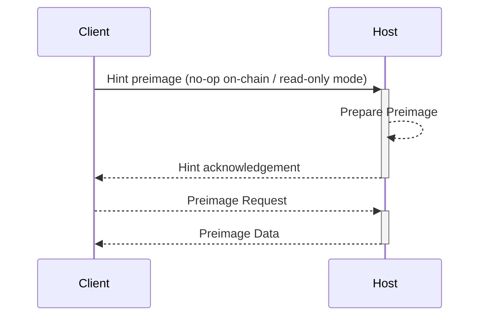

# Environment

Before kicking off the development of your own {{#template ../../templates/glossary-link.md root=../ text=Fault Proof Program ref=fault-proof-program}},
it's important to understand the environment that your program will be running in.

The FPP runs on top of a custom FPVM target, which is typically a VM with a modified subset of an existing reduced instruction set architecture and a subset of Linux syscalls. The FPVM is designed to
execute verifiable programs, and commonly modifies the instruction set it is derived from as well as the internal representation of memory to support verifiable memory access, `client` (program)
communication with the `host` (the FPVM), and other implementation-specific features.

## Host <-> Client Communication

While the program is running on top of the FPVM, it is considered to be in the `client` role, while the VM is in the `host` role. The only way for the `client` and `host`
to communicate with one another is synchronously through the {{#template ../../templates/glossary-link.md root=../ text=Preimage ABI ref=preimage-abi}} ([specification][preimage-specs]).

In order for the `client` to read from the `host`, special syscalls are modified within the FPVM to allow the `client` to request preparation of and read foreign data.

### Reading

When the `client` wants to read data from the `host`, it must first send a "hint" to the `host` through the hint file descriptor, which is a request for the `host` to prepare the data for reading. The `host` will then
prepare the data, and send a hint acknowledgement back to the `client`. The `client` can then read the data from the host through the designated file descriptor.

The preparation step ("hinting") is an optimization that allows the `host` to know ahead of time the intents of the `client` and the data it requires for execution. This can allow
for lazy loading of data, and also prevent the need for unnecessary allocations within the `host`'s memory. This step is a no-op on-chain, and is only ran locally
when the `host` is the native implementation of the FPVM.

## Full Example

Below, we have a full architecture diagram of the [`op-program`][op-program] (source: [fault proof specs][fp-specs]), the reference implementation for the OP Stack's Fault Proof Program,
which has the objective of verifying claims about the state of an [OP Stack][op-stack] layer two.

In this program, execution and derivation of the L2 chain is performed within it, and ultimately the claimed state of the L2 chain is verified in the [prologue](../prologue.md) stage.

It communicates with the `host` for two reasons:

1. To request preparation of L1 and L2 state data preimages.
1. To read the L1 and L2 state data preimages that were prepared after the above requests.

The `host` is responsible for:

1. Preparing and maintaining a store of the L1 and L2 state data preimages, as well as localized bootstrap k/v pairs.
1. Providing the L1 and L2 state data preimages to the `client` for reading.

Other programs (`clients`) may have different requirements for communication with the `host`, but the above is a common pattern for programs built on top of a FPVMs. In general:

1. The `client` program is a state machine that is responsible for bootstrapping itself from the inputs, executing the progam logic, and verifying the outcome.
1. The `host` is responsible for providing the `client` with data it wasn't bootstrapped with, and for executing the program itself.

{{#include ../links.md}}
