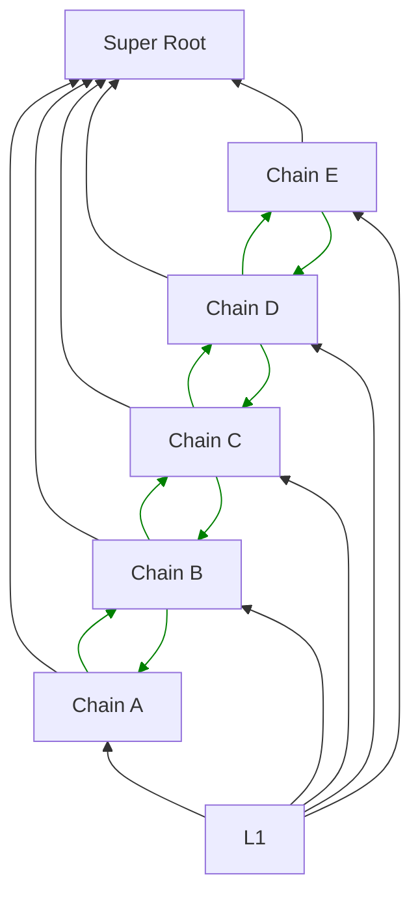
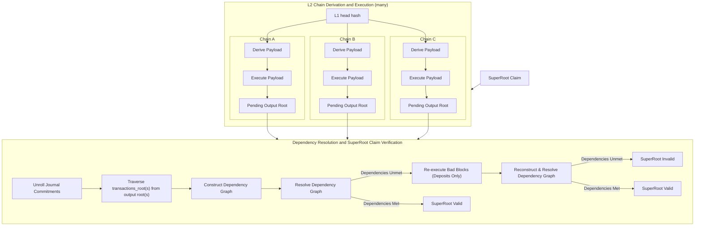

# Interop Proof

<!-- START doctoc generated TOC please keep comment here to allow auto update -->
<!-- DON'T EDIT THIS SECTION, INSTEAD RE-RUN doctoc TO UPDATE -->

- [Overview](#overview)
- [Definitions](#definitions)
  - [`SuperRoot`](#superroot)
  - [Hints](#hints)
  - [`BootInfo`](#bootinfo)
  - [Problem IDs](#problem-ids)
- [Sub-problems](#sub-problems)
  - [L2 Chain Derivation and Execution](#l2-chain-derivation-and-execution)
  - [Dependency Resolution and SuperRoot Claim Verification](#dependency-resolution-and-superroot-claim-verification)
  - [Journal Root](#journal-root)
- [Dispute Game Modifications](#dispute-game-modifications)
- [Additional Considerations](#additional-considerations)
  - [Holocene - `INVALID` payload handling](#holocene---invalid-payload-handling)
    - [Pending Output Root Preimages](#pending-output-root-preimages)
  - [[FPVM-specific] `StateWitness` extension: Journal](#fpvm-specific-statewitness-extension-journal)
    - [Journal Buffer](#journal-buffer)
  - [L1 as a Member](#l1-as-a-member)
  - [L1 + L2 History Accumulator - DoS Vector](#l1--l2-history-accumulator---dos-vector)
  - [Notepad](#notepad)

<!-- END doctoc generated TOC please keep comment here to allow auto update -->

This document is intended to specify the additions to the original [proof program][proof-program-spec] required to
support the [OP Stack's interop protocol][interop-spec]. Head over to the [interop spec][interop-spec] and the original,
single-chain [proof program spec][proof-program-spec] for pre-requisite information.

## Overview

The OP Stack's interop protocol enables intra-block cross-chain message passing within the Superchain by relaying
Ethereum logs. This introduces new challenges within the proof, requiring knowledge of other chains' state to determine
local block validity. L2 output proposals posted to L1 are now an aggregate of all L2s in the [dependency set][dep-set],
called the [`SuperRoot`](#superroot), to constrain the full state the superchain at a given time.

Verifying a [`SuperRoot`](#superroot) claim on L1 follows a similar pattern to the original spec for single-L2 output
root proposals. The process instead extends to `n` chains, with an additional step to check dependencies between
individual L2 outputs and finally aggregate the results into the broader [`SuperRoot`](#superroot) commitment. The
process works as follows:

1. Compute all L2 chains' pending output roots by:

   - Deriving and executing each individual chain
   - Using a trusted L1 block hash and agreed upon L2 prestate block hash as data commitments

2. Pass the computed output roots through a final step to:
   - Construct the dependency graph and determine [cross-chain message validity][msg-checks]
   - Reconstruct the [`SuperRoot`](#superroot) from the validated, sealed output roots
   - Compare the result against the original claim

To support this, we extend the original [proof program spec][proof-program-spec] with:

1. Additional constraints for [message validity checks][msg-checks] within each L2 block in the
   [`SuperRoot`](#superroot) structure
2. Support for validating the broader [`SuperRoot`](#superroot) hash that represents the aggregate superchain state
3. ["Sub-problem"](#sub-problems) support, allowing large execution sequences to be broken up and processed either
   optimistically or in parallel

and the fault proof VM with:

1. [Journal commitment support](#fpvm-specific-statewitness-extension-journal), allowing for programs to export data
   within the FPVM state witness commitment.

<center>



</center>

## Definitions

### `SuperRoot`

The [`SuperRoot`](#superroot) is an aggregate proposal of L2 superchain state to L1, from which other L2 activity can be
proven. It aggregates the output-roots of individual L2 chains, aligned to a single global timestamp.

A `SuperSnapshot` is defined as the following SSZ data-structure:

```python
MAX_SUPERCHAIN_SIZE = 2**20 # the binary merkle-tree is 20 levels deep (excluding the SSZ length-mixin)

class SuperSnapshot(Container:
  chains: List[OutputRoot, MAX_SUPERCHAIN_SIZE]
  timestamp: uint64
```

For each `OutputRoot`, the corresponding L2 block must be the last `safe` block such that
`block.timestamp <= snapshot.timestamp`.

The output-roots must be ordered by ascending chain ID, with exactly one output-root per L2 chain in the Superchain.

The [`SuperRoot`](#superroot) is computed from SSZ hash-tree-root of the snapshot, versioned with a zero prefix byte:
`0x00 ++ hash_tree_root(super_snapshot)[1:]`, where `||` is concatenation of bytes and `[1:]` slices out the first byte
of the hash-tree-root. The `hash_tree_root` is computed with the `keccak256` hash function rather than `SHA2` as in the
beacon-chain, for improved integration into the EVM.

The proof is contained to the L1 view of the [`SuperRoot`](#superroot) claim (all L1 history up to and including the L1
timestamp when the claim was made), and does not include later-included batch data.

### Hints

| Name            | Payload Encoding                   | Description                                                                                                                                 |
| --------------- | ---------------------------------- | ------------------------------------------------------------------------------------------------------------------------------------------- |
| `l2-super-root` | `l2-super-root <super_root_hash>`  | Populates the store with the preimages required to traverse the L2 super root passed.                                                       |
| `journal-root`  | `journal-root <journal_root_hash>` | Populates the store with the preimages required to traverse the merkle tree containing the execution journal commitments for each L2 chain. |
| `journal`       | `journal <journal_hash>`           | Populates the store with the preimage of the passed journal commitment.                                                                     |

### `BootInfo`

The `BootInfo` for the program is adjusted to support the new executing context.

1. Local key `2` is repurposed for the starting `SuperSnapshot` hash, rather than an output root
1. Local key `3` is repurposed for the disputed `SuperSnapshot` hash, rather than an output root
1. Local key `4` is repurposed for the disputed `SuperSnapshot` timestamp, rather than an L2 block number
1. Local key `5` is:
   - L2 Chain ID if Problem ID = `0`
   - Journal Root commitment if Problem ID = `1`
1. Local key `8` is introduced for the sub-problem identifier

The local keys recognized by the proof program are now:

| Identifier | Description                                            |
| ---------- | ------------------------------------------------------ |
| `1`        | Parent L1 head hash at the time of the proposal        |
| `2`        | (**REPURPOSED**) Starting `SuperSnapshot` hash         |
| `3`        | (**REPURPOSED**) Disputed `SuperSnapshot` hash         |
| `4`        | (**REPURPOSED**) Disputed L2 `SuperSnapshot` timestamp |
| `5`        | L2 Chain ID or Journal Root Commitment                 |
| `8`        | (**NEW**) Problem ID                                   |

### Problem IDs

| ID  | Problem                                                |
| --- | ------------------------------------------------------ |
| `0` | L2 Chain Derivation and Execution                      |
| `1` | Dependency Resolution and SuperRoot Claim Verification |

## Sub-problems

Stages of [`SuperRoot`](#superroot) computation are divided into distinct sub-problems. This approach lends well to both
interactive and non-interactive proving systems by providing isolated computation segments that can be efficiently
bisected or processed in parallel depending on the application.

Sub-problems are ordered and can be flattened in order to be synchronously executed (or represented as a synchronous
stream of execution) if desired. Problem IDs are assigned in the order of the problem's execution.

<center>



</center>

### L2 Chain Derivation and Execution

The [existing program][proof-program-spec] is repurposed to represent the first sub-problem of [`SuperRoot`](#superroot)
verification, which is deriving and executing a single L2 chains' payload from verifiable data commitments on L1. It no
longer performs the final verification, and instead generates an intermediate pending output root as a part of the
broader [`SuperRoot`](#superroot) computation.

To enable this:

1. The program's [prologue stage](https://specs.optimism.io/fault-proof/index.html?highlight=epilogue#prologue) is
   changed to pull in the agreed upon L2 output root from the agreed upon super root claim, depending on the passed L2
   chain ID.
1. The final step in the program's
   [epilogue stage](https://specs.optimism.io/fault-proof/index.html?highlight=epilogue#epilogue) is changed to commit
   the computed pending output root to the journal. The validity check for the claim within the boot info is not
   preserved.

### Dependency Resolution and SuperRoot Claim Verification

The dependency resolution and [`SuperRoot`](#superroot) claim verification sub-problem is responsible for accepting the
pending output roots from all L2 chains as well as the original super root claim, enforcing [message validity
invariants][msg-checks], and validating the [`SuperRoot`](#superroot) claim.

It starts by unwinding the pending output roots and traversing their `transactions_root`s to construct the [Dependency
Graph][dep-set], before resolving the graph to enforce [message validity invariants][msg-checks].

In the event that dependencies are unmet, per the Holocene `INVALID` engine response rule, bad blocks are stripped to
only their deposits and re-inserted into the dependency graph before attempting resolution again. This process can
recurse until all bad blocks detected during dependency graph resolution contain no user-space transactions.

Finally, once dependency resolution has completed, the [`SuperRoot`](#superroot) is reconstructed and compared with the
original claim. If the [`SuperRoot`](#superroot) matches the claim, exit with code `0`. Otherwise, exit with code `1`.

### Journal Root

In order to pass the pending output root(s) generated in the "L2 chain derivation and execution" sub-problem runs to the
"Dependency Resolution and SuperRoot Claim Verification" sub-problem, we construct a binary merkle tree with leaves
committing to the hashed tuple of `(l2_chain_id, pending_output_root)`.

**Leaf Construction**:

```python
# l2_chain_id is encoded as a big-endian u64.
# `||` denotes concatenation
leaf = keccak256(u64(l2_chain_id) || pending_output_root)
```

## Dispute Game Modifications

_TODO_: When posting an execution trace root, the user will make all sub-problem commitments available, in-order. All
chains' final FPVM state witness hashes are used to construct the input to the dependency graph resolution sub-problem.
The challenger can then decide which individual chains' pending OR is incorrect, or if the dependency graph resolution
is incorrect, in a special n-nary step.

## Additional Considerations

### Holocene - `INVALID` payload handling

In the Holocene hardfork, a
[new consensus rule](https://specs.optimism.io/protocol/holocene/derivation.html#engine-queue) was added to the Rollup
Node that changes the behavior of `INVALID` payload status handling from the Execution Layer's engine response. After
Holocene fork activation, if a block fails to execute and the engine returns `INVALID`, the rollup node will re-attempt
to execute the payload in question. However, it will include _only_ the deposits from within the original, `INVALID`
payload. In other words, all user-space transactions are pruned in the event of the engine returning `INVALID` in an
attempt to process a valid block.

This behavior extends to the new payload validity rule that comes with the Interop hardfork, which is that all
[dependencies][dep-set] within a block must be met. If not, an attempt will be made to resolve the dependency graph with
just the trimmed (deposit-only) payload.

This creates an interesting challenge for the interop proof program. We know we may need to re-execute the block if
dependencies are unmet, but the preimages for the pending OR in the case that the block is stripped to deposits only
during dependency resolution are not readily available to the host. They are not necessarily the output roots that ended
up in the final super root.

There are a couple of ideas that have been tossed around:

- Compute both the deposit only and the full block's output roots in the first sub-problem. (More redundant work.)
- Re-execute within the second sub-problem if dependencies are unmet. (Less redundant work.)

But the tradeoff space hasn't yet been explored too deeply. For now, I've gone with B with the hope that it won't add
too much complexity while limiting the amount of redundant proving work in the happy path.

#### Pending Output Root Preimages

_TODO_: Cover populating the K/V store with the preimages required to decompose pending output roots passed into the
second sub-problem.

### [FPVM-specific] `StateWitness` extension: Journal

For the sub-problem design to be flexible and allow for convenient intermediate data passing, we need the ability to
pass data from one sub-problem to other dependent sub-problems. This is currently not possible with FPVMs due to the
limitations of respective `StateWitness` hash preimage construction.

This is not a concern of zkVMs that use kona. SP-1 and RiscZero have the ability to commit to outputs, and can already
take advantage.

#### Journal Buffer

A write-only file descriptor is exposed to the client program at fd = `7`, allowing for the client program to accumulate
data in a global journal buffer. This journal buffer must be included in the `StateWitness` encoding used to compute the
state witness hash posted to the on-chain `DisputeGame`.

**Invariants**:

- At the beginning of program execution, this journal buffer is empty.
- It cannot be cleared by the kernel or the user.
- No data written to the journal buffer may be overwritten.
- The journal buffer may only expand.

### L1 as a Member

For Ethereum-settling OP Stack chains, L1 can be trivially included as an "outbound only" interop message source within
the proof. Adding support for this would entail allowing
[Executing Messages](https://specs.optimism.io/interop/messaging.html#executing-messages) to reference a log in the L1
chain. In the dependency resolution phase, we would simply unroll the L1 head hash to traverse through history and
reference any [Initiating Messages](https://specs.optimism.io/interop/messaging.html#initiating-messages).

While this is a powerful addition to the protocol, a trade-off to make is that it implies more frequent updates to the
proof's absolute prestate or verification key on-chain. In a world where our upgrade process is delayed, this may be
challenging given the sometimes low lead-time for L1 hardfork scheduling.

### L1 + L2 History Accumulator - DoS Vector

Neither the L1 or L2 protocol currently have a history accumulator with efficient verifiable lookups. This makes lookups
of old messages very inefficient in practice, having a linear-time parent-hash walkback to check for logs referenced in
history during the dependency resolution sub-problem.

To scale interop and allow for the current
[Message Expiry Window](https://specs.optimism.io/interop/messaging.html#message-expiry-invariant) value (180 days), we
must have a history accumulator with a more efficient lookup.

For L2, the [Header Accumulator](https://github.com/ethereum-optimism/specs/pull/259) is currently proposed for a future
hardfork. In order to consider [L1 as a member](#l1-as-a-member), we will need a similar feature on L1, or re-use
[EIP-2935](https://github.com/ethereum/EIPs/blob/master/EIPS/eip-2935.md) and have a special case where L1's message
expiry window is shorter than that of L2.

### Notepad

- [ ] Weird chain ID dependency - which chain ID is a leaf in the super root? It's a SSZ tree, not a trie, so there's no
      current notion.
- Proto conversation:
  - Having n-nary bisection is **BAD**. We cannot do this. We need a minimal diff to the dispute game!!
  - The sub-problem approach is good, but does the business need ZK as a first class citizen?

[super-root]: #super-root
[msg-checks]: https://specs.optimism.io/interop/messaging.html#invalid-messages
[interop-spec]: https://specs.optimism.io/interop/overview.html
[dep-set]: https://specs.optimism.io/interop/dependency-set.html#the-dependency-set
[proof-program-spec]: https://specs.optimism.io/fault-proof/index.html
