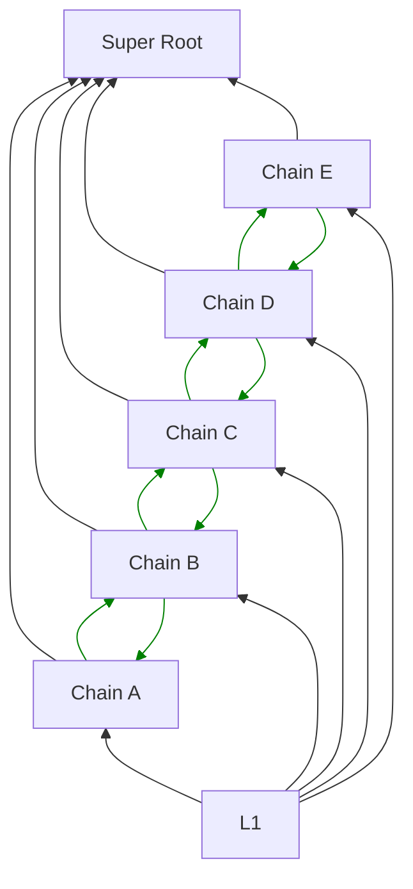
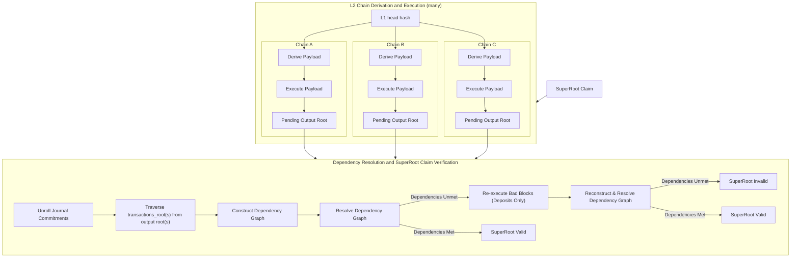

# Interop Proof

<!-- START doctoc generated TOC please keep comment here to allow auto update -->
<!-- DON'T EDIT THIS SECTION, INSTEAD RE-RUN doctoc TO UPDATE -->

- [Overview](#overview)
- [Definitions](#definitions)
  - [`SuperRoot`](#superroot)
  - [Hints](#hints)
  - [`BootInfo`](#bootinfo)
  - [Problem IDs](#problem-ids)
- [Sub-problems](#sub-problems)
  - [[FPVM-specific] `StateWitness` extension: Journal](#fpvm-specific-statewitness-extension-journal)
    - [Journal Buffer](#journal-buffer)
- [Additional Considerations](#additional-considerations)
  - [Holocene - `INVALID` payload handling](#holocene---invalid-payload-handling)
  - [L1 as a Member](#l1-as-a-member)
  - [L2 History Accumulator - DoS Vector](#l2-history-accumulator---dos-vector)
  - [TODOs](#todos)

<!-- END doctoc generated TOC please keep comment here to allow auto update -->

This document is intended to specify the additions to the original [proof program][proof-program-spec] required to
support the [OP Stack's interop protocol][interop-spec]. Head over to the [interop spec][interop-spec] and the original,
single-chain [proof program spec][proof-program-spec] for pre-requisite information.

## Overview

The OP Stack's interop protocol enables intra-block cross-chain message passing within the Superchain by relaying
Ethereum logs. This introduces new challenges within the proof, requiring knowledge of other chains' state to determine
local block validity. L2 output proposals posted to L1 are now an aggregate of all L2s in the [dependency set][dep-set],
called the [`SuperRoot`](#superroot), to constrain the full state the superchain at a given time.

Verifying a [`SuperRoot`](#superroot) claim on L1 follows a similar pattern to the original spec for single-L2 output
root proposals. The process instead extends to `n` chains, with an additional step to check dependencies between
individual L2 outputs and finally aggregate the results into the broader `SuperRoot` commitment. The process works as
follows:

1. Compute all L2 chains' pending output roots by:

   - Deriving and executing each individual chain
   - Using a trusted L1 block hash and agreed upon L2 prestate block hash as data commitments

2. Pass the computed output roots through a final step to:
   - Construct the dependency graph and determine [cross-chain message validity][msg-checks]
   - Reconstruct the `SuperRoot` from the validated, sealed output roots
   - Compare the result against the original claim

To support this, we extend the original [proof program spec][proof-program-spec] with:

1. Additional constraints for [message validity checks][msg-checks] within each L2 block in the
   [`SuperRoot`](#superroot) structure
2. Support for validating the broader [`SuperRoot`](#superroot) hash that represents the aggregate superchain state
3. ["Sub-problem"](#sub-problems) support, allowing large execution sequences to be broken up and processed either
   optimistically or in parallel

<center>


```mermaid
flowchart BT
    L1
    L1 --> L2_A["Chain A"]
    L1 --> L2_B["Chain B"]
    L1 --> L2_C["Chain C"]
    L1 --> L2_D["Chain D"]
    L1 --> L2_E["Chain E"]
    L2_A --> S["Super Root"]
    L2_B --> S
    L2_C --> S
    L2_D --> S
    L2_E --> S

    L2_A --> L2_B
    L2_B --> L2_A
    L2_C --> L2_B
    L2_B --> L2_C
    L2_D --> L2_C
    L2_C --> L2_D
    L2_E --> L2_D
    L2_D --> L2_E

    linkStyle 10,11,12,13,14,15,16,17 stroke:green;
```

</center>

## Definitions

### `SuperRoot`

The `SuperRoot` is an aggregate proposal of L2 superchain state to L1, from which other L2 activity can be proven. It
aggregates the output-roots of individual L2 chains, aligned to a single global timestamp.

A `SuperSnapshot` is defined as the following SSZ data-structure:

```python
MAX_SUPERCHAIN_SIZE = 2**20 # the binary merkle-tree is 20 levels deep (excluding the SSZ length-mixin)

class SuperSnapshot(Container:
  chains: List[OutputRoot, MAX_SUPERCHAIN_SIZE]
  timestamp: uint64
```

For each `OutputRoot`, the corresponding L2 block must be the last `safe` `block` such that
`block.timestamp <= snapshot.timestamp`.

The output-roots must be ordered by ascending chain ID, with exactly one output-root per L2 chain in the Superchain.

The `SuperRoot` is computed from SSZ hash-tree-root of the snapshot, versioned with a zero prefix byte:
`0x00 ++ hash_tree_root(super_snapshot)[1:]`, where `||` is concatenation of bytes and `[1:]` slices out the first byte
of the hash-tree-root. The `hash_tree_root` is computed with the `keccak256` hash function rather than `SHA2` as in the
beacon-chain, for improved integration into the EVM.

The proof is contained to the L1 view of the `SuperRoot` claim (all L1 history up to and including the L1 timestamp when
the claim was made), and does not include later-included batch data.

### Hints

A new hint is added to fetch the preimage of a `SuperRoot` hash.

| Name            | Payload Encoding                  | Response                |
| --------------- | --------------------------------- | ----------------------- |
| `l2-super-root` | `l2-super-root <super_root_hash>` | `<super_root_preimage>` |

### `BootInfo`

The `BootInfo` for the program is adjusted to support the new executing context.

1. Local key `2` is repurposed for the starting `SuperSnapshot` hash, rather than an output root
1. Local key `3` is repurposed for the disputed `SuperSnapshot` hash, rather than an output root
1. Local key `4` is repurposed for the disputed `SuperSnapshot` timestamp, rather than an L2 block number
1. Local key `5` is not required if Problem ID != `1`
1. Local key `8` is introduced for the sub-problem identifier

The local keys recognized by the proof program are now:

| Identifier | Description                                              |
| ---------- | -------------------------------------------------------- |
| `1`        | Parent L1 head hash at the time of the proposal          |
| `2`        | (**REPURPOSED**) Starting `SuperSnapshot` hash           |
| `3`        | (**REPURPOSED**) Disputed `SuperSnapshot` hash           |
| `4`        | (**REPURPOSED**) Disputed L2 `SuperSnapshot` timestamp   |
| `5`        | L2 Chain ID (**NEW**: Not required if Problem ID != `0`) |
| `8`        | (**NEW**) Identifier of the sub-problem.                 |

### Problem IDs

| ID  | Problem                                                |
| --- | ------------------------------------------------------ |
| `0` | L2 Chain Derivation and Execution                      |
| `1` | Dependency Resolution and SuperRoot Claim Verification |

## Sub-problems

Stages of `SuperRoot` computation are divided into distinct sub-problems. This approach lends well to both interactive
and non-interactive proving systems by providing isolated computation segments that can be efficiently bisected or
processed in parallel depending on the application.

Sub-problems are ordered and can be flattened in order to be synchronously executed (or represented as a synchronous
stream of execution) if desired. Problem IDs are assigned in the order of the problem's execution.

<center>


```mermaid
flowchart TD
    S["SuperRoot Claim"]

    S --> A
    B_CA_C --> B
    B_CB_C --> B
    B_CC_C --> B

    subgraph A["L2 Chain Derivation and Execution (many)"]
      B_L1["L1 head hash"]
      B_L1 --> B_CA_A
      B_L1 --> B_CB_A
      B_L1 --> B_CC_A

      subgraph B_CA["Chain A"]
        B_CA_A["Derive Payload"]
        B_CA_A --> B_CA_B["Execute Payload"]
        B_CA_B --> B_CA_C["Pending Output Root"]
      end

      subgraph B_CB["Chain B"]
        B_CB_A["Derive Payload"]
        B_CB_A --> B_CB_B["Execute Payload"]
        B_CB_B --> B_CB_C["Pending Output Root"]
      end

      subgraph B_CC["Chain C"]
        B_CC_A["Derive Payload"]
        B_CC_A --> B_CC_B["Execute Payload"]
        B_CC_B --> B_CC_C["Pending Output Root"]
      end
    end

    subgraph B["Dependency Resolution and SuperRoot Claim Verification"]
        A_A["Unroll Journal Commitments"] --> A_B["Traverse transactions_root(s) from output root(s)"]
        A_B --> A_C["Construct Dependency Graph"]
        A_C --> A_D["Resolve Dependency Graph"]

        A_D -- "Dependencies Unmet" --> A_D_Y["Re-execute Bad Blocks (Deposits Only)"]
        A_D_Y --> A_D_R["Reconstruct & Resolve Dependency Graph"]
        A_D_R -- "Dependencies Unmet" --> A_D_R_Y["SuperRoot Invalid"]
        A_D_R -- "Dependencies Met" --> A_D_R_N["SuperRoot Valid"]

        A_D -- "Dependencies Met" --> A_D_N["SuperRoot Valid"]
    end
```

</center>

## Additional Considerations

### Holocene - `INVALID` payload handling

In the Holocene hardfork, a
[new consensus rule](https://specs.optimism.io/protocol/holocene/derivation.html#engine-queue) was added to the Rollup
Node that changes the behavior of `INVALID` payload status handling from the Execution Layer's engine response. After
Holocene fork activation, if a block fails to execute and the engine returns `INVALID`, the rollup node will re-attempt
to execute the payload in question. However, it will include _only_ the deposits from within the original, `INVALID`
payload. In other words, all user-space transactions are pruned in the event of the engine returning `INVALID` in an
attempt to process a valid block.

This behavior extends to the new payload validity rule that comes with the Interop hardfork, which is that all
[dependencies][dep-set] within a block must be met. If not, an attempt will be made to resolve the dependency graph with
just the trimmed (deposit-only) payload.

This creates an interesting challenge for the interop proof program. We know we may need to re-execute the block if
dependencies are unmet, but the preimages for the pending OR in the case that the block is stripped to deposits only
during dependency resolution are not readily available to the host. They are not necessarily the output roots that
ended up in the final super root.

There are a couple of ideas that have been tossed around:
* Compute both the deposit only and the full block's output roots in the first sub-problem. (More redundant work.)
* Re-execute within the second sub-problem if dependencies are unmet. (Less redundant work.)

But the tradeoff space hasn't yet been explored too deeply. For now, I've gone with B with the hope that it won't add
too much complexity while limiting the amount of redundant proving work in the happy path.

### [FPVM-specific] `StateWitness` extension: Journal

For the sub-problem design to be flexible and allow for convenient intermediate data passing, we need the ability to
pass data from one sub-problem to other dependent sub-problems. This is currently not possible with FPVMs due to the
limitations of respective `StateWitness` hash preimage construction.

This is not a concern of zkVMs that use kona. SP-1 and RiscZero have the ability to commit to outputs, and can already
take advantage.

#### Journal Buffer

A write-only file descriptor is exposed to the client program at fd = `7`, allowing for the client program to accumulate
data in a global journal buffer. This journal buffer must be included in the `StateWitness` encoding used to compute the
state witness hash posted to the on-chain `DisputeGame`.

**Invariants**:

- At the beginning of program execution, this journal buffer is empty.
- It cannot be cleared by the kernel or the user.
- No data written to the journal buffer may be overwritten.
- The journal buffer may only expand.

### L1 as a Member

_TODO_: L1's inclusion as a outbound-only message source.

### L2 History Accumulator - DoS Vector

_TODO_: Complex L2 history lookups for deep dependencies. The message expiry is 180d, yadda yadda.

While not pertinent to the spec, the protocol currently does not have a L2 history accumulator. This makes lookups of
old messages very inefficient in practice, having a linear-time parent-hash walkback to check for logs referenced in
history during the dependency resolution sub-problem.

### TODOs

- [ ] Fucked up dependency of the pending OR preimage
- [ ] Weird chain ID dependency - which chain ID is a leaf in the super root?

[super-root]: #super-root
[msg-checks]: https://specs.optimism.io/interop/messaging.html#invalid-messages
[interop-spec]: https://specs.optimism.io/interop/overview.html
[dep-set]: https://specs.optimism.io/interop/dependency-set.html#the-dependency-set
[proof-program-spec]: https://specs.optimism.io/fault-proof/index.html
